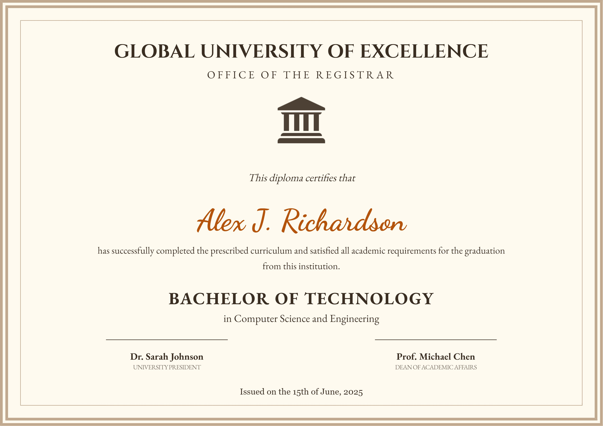
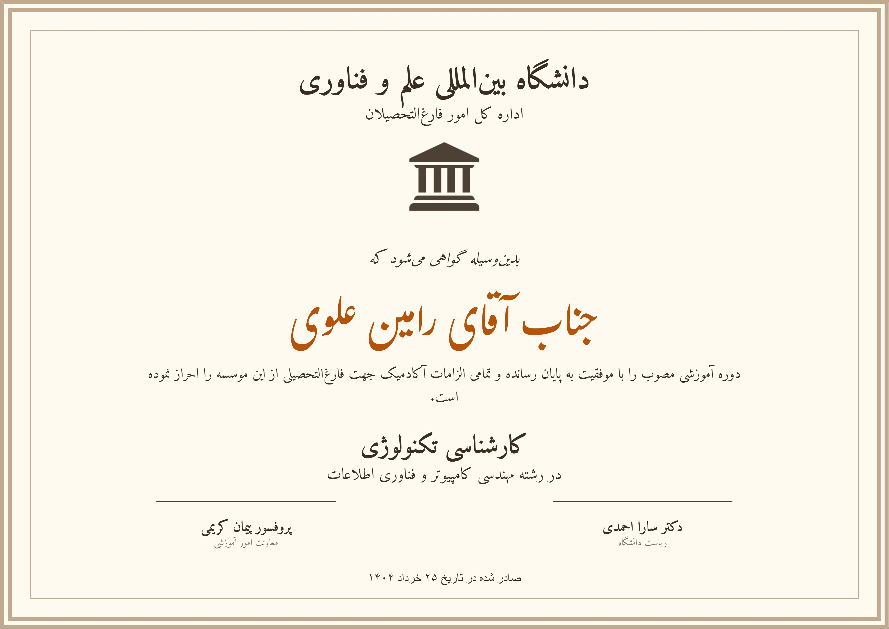

🎓 Professional A4 Certificate Generator

یه ابزار ساده برای ساخت گواهی‌نامه (بدون نیاز به سرور)

🇬🇧 English

<em>Standard Garamond & Cinzel Fonts</em>

I created this project because I wanted a way to generate certificates quickly and without any limits. It's a simple, straightforward tool that lets you design and download perfect A4 PDFs directly from your browser, no strings attached.

🚀 What's Inside?

Client-Side & Secure: Everything happens right in your browser. Since there’s no server involved, your data stays private and never leaves your computer.

Print-Ready A4: I used millimeters (mm) for everything, so when you hit print, it fits perfectly on a standard A4 sheet (210x297mm).

Landscape & Portrait: Whether you want a wide diploma or a tall certificate, you can switch between modes with one click.

Bilingual Support: It works for both English and Persian. I've set it up to automatically switch to the right fonts (Cinzel/Garamond for English and Amiri/Gulzar for Persian) so it always looks professional.

Sharp Exports: I used some clever tricks with html2canvas and jsPDF to make sure the final files aren't blurry and look great in print.

Live Editing: No complex forms. Just click on any text on the certificate and type whatever you want.

🛠️ Tech Stack

HTML5 & Tailwind CSS

JavaScript (ES6+)

html2canvas & jsPDF (Loaded via CDN)

📄 License

This project is open-sourced under the MIT License.

🇮🇷 Persian (فارسی)

<em>Official Amiri & Nastaliq (Gulzar) Fonts</em>

این پروژه رو برای این ساختم که هر وقت لازم شد، بتونم خیلی راحت و بدون هیچ محدودیتی گواهی‌نامه بسازم. یه ابزار ساده‌ست که مستقیم توی مرورگر کار می‌کنه و چون نیازی به سرور نداره، اطلاعاتت جایی ذخیره نمی‌شه و کاملاً امنه.

🚀 ویژگی‌ها

راحت و نامحدود: هر چندتا گواهی‌نامه که بخوای می‌تونی بسازی. همه پردازش‌ها روی سیستم خودت انجام می‌شه و هیچ هزینه‌ای نداره.

سایز دقیق A4: اندازه‌ها رو بر اساس میلی‌متر (mm) تنظیم کردم که موقع چاپ، دقیقاً اندازه کاغذ A4 (۲۱۰ در ۲۹۷) باشه و لبه‌هاش خراب نشه.

افقی و عمودی: با یه کلیک ساده می‌تونی جهت کاغذ رو عوض کنی. چیدمان المان‌ها خودش با حالت جدید جور می‌شه.

فارسی و انگلیسی: سیستم کاملاً دو زبانه است. وقتی زبان رو عوض می‌کنی، هم چیدمان راست‌چین می‌شه و هم فونت‌ها به «امیری» و «نستعلیق» تغییر می‌کنند تا خروجی نهایی کاملاً رسمی و شیک باشه.

خروجی باکیفیت: فایل‌های PDF و عکسی که می‌گیری با رزولوشن بالا ساخته می‌شن که موقع چاپ تار نباشن.

ویرایش مستقیم: نیاز به پنل مدیریت و تنظیمات نداری؛ فقط روی هر متنی که می‌خوای کلیک کن و بنویس.

🛠️ تکنولوژی‌ها

HTML5 & Tailwind CSS

JavaScript (ES6+)

html2canvas & jsPDF

📄 لایسنس

این پروژه تحت لایسنس MIT منتشر شده و استفاده ازش کاملاً آزاده.

